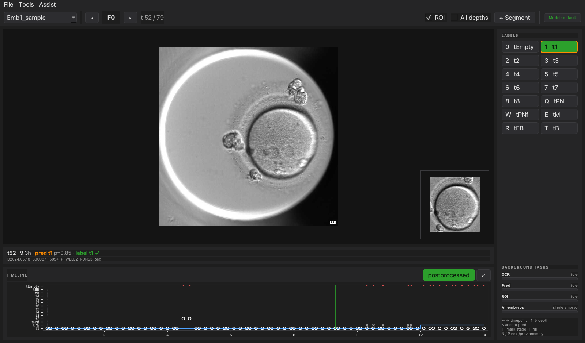
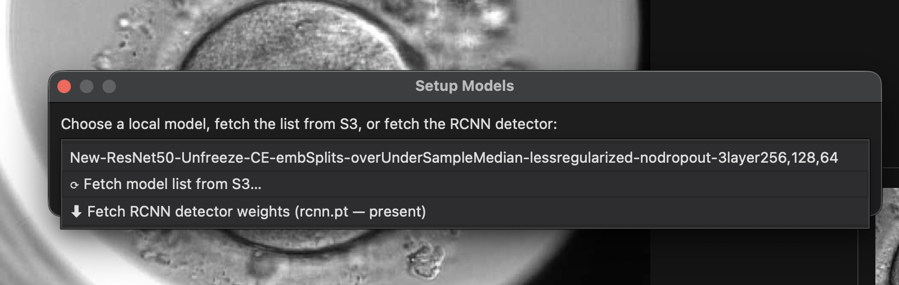
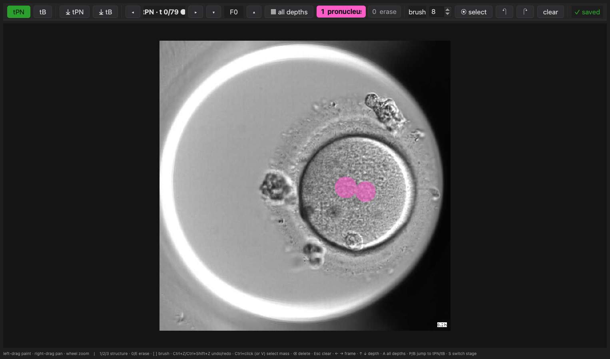

# Embryo Labeler

[](https://youtu.be/1FnU7oKbJ0c)

A keyboard-first desktop GUI for labeling time-lapse embryo images across **patients,
timepoints, and focal depths** — with optional assisted labeling (OCR clock times, model
stage predictions, RCNN embryo ROI) and a pixel-level **segmentation pane** for tPN / tB
masks.



## Quick start

```bash
# 1. Clone
git clone https://github.com/berkyalcinkaya/emb_labeler.git
cd emb_labeler

# 2a. Install — conda/mamba (recommended; includes the assisted-labeling stack)
mamba env create -f environment.yml
mamba activate emb_labeler

# 2b. …or core GUI only, into any Python 3 env
pip install -r requirements.txt

# 3. Run
python gui.py
```

Then **drag an embryo or dataset folder onto the window** (or **File ▸ Open Dataset…**) and
start labeling — **← →** move through timepoints, **↑ ↓** through focal depths, and a class
hotkey labels the current frame.

## At a glance

- ⌨️ **Keyboard-first** — arrows navigate, number/letter hotkeys label; minimal clicking.
- 🔭 **7 focal depths** per timepoint, with a side-by-side **All depths** view.
- 🤖 **Optional assisted labeling** — per-frame OCR hours, model stage predictions, RCNN
  embryo ROI, and anomaly flags; accept/fill labels in a keystroke.
- 🎨 **Pixel-level segmentation** — paint pronucleus masks at tPN and TE/ICM/ZP at tB.
- 📊 **Dashboard** — labeling completion and class distribution across the dataset.
- 💾 **Durable writes** — human labels in `labels.json`, computed artifacts in separate
  per-patient sidecars that are never overwritten.

Assisted features degrade gracefully: if their dependencies or model weights are missing,
the core labeler still works (center-crop ROIs, no predictions).

## Input data

Point the labeler at **either** a single embryo folder **or** a dataset root containing
many — both are accepted, and you can drop more folders at any time to add them:

```text
dataset_root/                 ← drop this for many embryos…
  patient_001/                ← …or drop a single embryo folder directly
    F-45/  F-30/  F-15/  F0/  F15/  F30/  F45/
        *.tif  *.png  *.jpeg  …
  patient_002/
    ...
```

The format is **flexible**:

- **Single embryo or a whole dataset** — a folder that directly contains focal-depth
  subdirs (`F-45 … F45`) loads as one embryo; otherwise its subfolders load as separate
  embryos.
- **Any subset of the 7 depths** — e.g. only `F-15, F0, F15`. Missing depths render empty
  and stay navigable.
- **Common image formats** — `.tif/.tiff`, `.png`, `.jpeg/.jpg`.
- **True temporal order** — frames are sorted by their `RUN<n>` index, matching
  embpred_deploy's timelapse inference / `--postprocess` output (zero-padded names sort
  identically; files without a `RUN` token fall back to filename order).

Focal-depth order is fixed: `["F-45", "F-30", "F-15", "F0", "F15", "F30", "F45"]`.

## Interface

The window is a keyboard-first "cockpit" (dark theme):

- **Header** — patient selector, focal-depth nav (`◂ F0 ▸`), the `t / N` timepoint
  counter, and view toggles (ROI inset, All depths, **✏ Segment**).
- **Main image** — fills the pane with no axis/histogram chrome; the **ROI** is a
  picture-in-picture inset in the corner (toggle with the header **ROI** checkbox).
- **HUD bar** (under the image) — current timepoint, OCR hour, model prediction +
  confidence, your saved label, and any anomaly for this frame.
- **Timeline strip** (bottom) — the embedded stage/OCR timeline; click to jump, toggle
  raw/postprocessed, or `⤢` to open the full-size window.
- **Right rail** — label chips (each shows its hotkey; the model's predicted class is
  outlined in orange), and a **Background tasks** section with a progress bar for each of
  OCR / Pred / ROI (plus **All embryos**). **Click a running bar to pause that task, and
  click it again to resume** (see [Pausing and resuming](#pausing-and-resuming)).

### Labeling

Press a class's hotkey to label the current timepoint — `0` = tEmpty, `1`–`8` = t1–t8,
and `Q W E R T` = tPN, tPNf, tM, tEB, tB (or click the chip). Arrow keys navigate:
**← →** timepoint, **↑ ↓** focal depth.

## Files written into each patient folder

### `labels.json`

```json
{
  "timepoint_labels": {
    "0": "tPN",
    "1": "t2"
  }
}
```

### `label_metadata.json`

A list of label-save events, used by the Dashboard to show labeling progress over time.

```json
[
  {
    "timestamp": "2026-05-27T12:34:56+00:00",
    "patient_id": "patient_001",
    "event_type": "timepoint_label",
    "timepoint": 0,
    "value": "tPN",
    "previous_value": null,
    "action": "created",
    "complete": true
  }
]
```

## Dashboard

Open **Tools > Dashboard** after loading a dataset. It shows:

1. Completion percentages for timepoint labels, overall and by patient.
2. Distribution of timepoint classes across the dataset.
3. Cumulative labeling progress over time from `label_metadata.json`.

## Assisted labeling

The labeler can preload **OCR hours** and **model stage predictions**, surface
**anomalies**, and let you accept/fill labels with few keystrokes. These features are
optional — if their dependencies (see `requirements.txt`) are missing, the core labeler
still works (center-crop ROIs, no predictions).

### Automatic background processing

When you open an embryo, three tasks start automatically off the UI thread, each shown
as a progress bar in the right rail's **Background tasks** section: **OCR**, **Pred**
(predictions), and **ROI** (RCNN bboxes). A bar is gray when idle/paused, green while
running/done, and red on error (hover for detail). Already-current results are skipped
(OCR/predictions recompute only when missing or when the image set changed; bbox skips
frames already cached), and labeling is never blocked.

**Tasks belong to their embryo, not to the screen.** Each task runs to completion on its
own; **navigating to another embryo never pauses or cancels it** — it keeps running in
the background while the bars switch to show the embryo you're now viewing (and switch
back, mid-progress, when you return). **Every loaded embryo starts computing on its own**
without waiting for you to open it: a bounded number of other embryos compute alongside
the one on screen, with the rest starting as those finish. The model (predictions / RCNN)
is shared and runs one forward pass at a time, and **the on-screen embryo gets priority**
— background embryos step aside between timepoints so the embryo you're labeling finishes
first; priority follows the screen as you navigate. The **All embryos** bar shows how many
embryos are fully done (`done / total`); click it to pause or resume the whole background
sweep (the on-screen embryo keeps going).

The **ROI** bar advances per timepoint. When a model is loaded, the embryo's bounding box
is detected once per timepoint *by the prediction task* and reused for every focal depth
(no duplicate detector runs), so the ROI bar mirrors prediction progress (shown as
"… via predictions"). With no model loaded, ROI runs as its own detector task.

Predictions default to the model `New-ResNet50-Unfreeze-CE-embSplits-…-3layer256,128,64`;
if its weights aren't present the **Pred** bar turns red with "weights missing" — fetch it
(or pick another model) via **Tools ▸ Setup Models**. The Tools menu can also re-trigger
any of the three on demand.

### Pausing and resuming

The progress-bar widgets are the controls — a click does different things depending on
the bar's state (the tooltip always tells you which):

- **Running → click to pause.** The task stops and the bar goes gray ("paused N/T"). Work
  done so far is flushed to the patient's sidecar files, so nothing is lost.
- **Paused → click again to resume.** *This is how you resume a paused embryo.* The task
  restarts from where it stopped — it reads the sidecar and skips the timepoints already
  computed, rather than starting over.
- **Done ("cached") → click does nothing** (the work is already complete).
- **Error / "weights missing" → click to retry** (after fixing the cause, e.g. installing
  weights via **Tools ▸ Setup Models**).

Pausing is the **only** thing that stops a task — it never happens on its own, and a
paused task stays paused across navigation (switching embryos won't silently resume it).
The same click-to-pause / click-to-resume applies to the **All embryos** sweep bar.
Resuming a task is also available from the **Tools** menu (**Run OCR Times**, **Run /
Re-run Predictions**, **Detect ROIs**), which act on the embryo currently on screen.

### Tools menu

- **Setup Models…** — choose a local classifier checkpoint, or fetch the list from the
  private S3 bucket (`cfai-model-weights`) and download missing weights via the AWS CLI.
  Both the chosen `*.pth` checkpoint and `rcnn.pt` are required.

  

  Downloaded weights are saved to a labeler-owned cache, **not** inside the
  `embpred_deploy` package — `$EMB_LABELER_MODELS_DIR` if set, else
  `~/.cache/emb_labeler/models/`. This survives `embpred_deploy` reinstalls/upgrades.

- **Run OCR Times** — OCRs the embedded clock (bottom-right of each frame, reference
  depth F0 with retries) and writes per-timepoint hours; failures are interpolated.
- **Run / Re-run Predictions** — runs inference on the 3-depth subset (`F-15, F0, F15`),
  applies monotonic postprocessing, and caches per-timepoint predictions. Re-run
  recomputes; predictions are also flagged when the image set changes.
- **Detect ROIs (RCNN)** — computes the embryo bounding box for every timepoint at the
  reference depth (F0, or the first populated depth) and caches it; the one box is reused
  across all focal depths. When a model is loaded this defers to predictions (which detect
  and cache the same boxes).
- **Timeline** — stage/OCR timeline (x = OCR hours, y = stage). Shows the postprocessed
  sequence (toggle raw argmax), saved labels, and flagged anomalies. Click to jump.

### ROI detection

`EmbryoLabelingApp.get_ROI()` now uses embpred_deploy's Faster-RCNN (`rcnn.pt`) with a
center-crop fallback. One box per timepoint is detected at the reference depth and reused
for every focal depth. The ROI view shows an instant center crop and is replaced by the
detected box once it is available for that timepoint (off the UI thread); boxes are cached
so revisiting is instant. If detection fails (e.g. missing weights) it is disabled for the
session and the labeler stays on center crops — install weights via **Tools ▸ Setup
Models**, then re-run **Tools ▸ Detect ROIs** to retry.

### Keyboard shortcuts (assisted)

| Key | Action |
| --- | --- |
| `[` / `]` | Mark stage start / end at the current timepoint |
| `F` | Fill the marked stage `[start, end]` with the selected class |
| `A` | Accept the prediction at the current timepoint |
| `N` / `P` | Jump to next / previous flagged anomaly |

(Arrow keys still drive timepoint/depth navigation.) The **Assist** menu also exposes
"Accept predictions for stage" and "Toggle raw / postprocessed".

## Segmentation pane (pixel-level masks)

Beyond per-timepoint classification, the labeler can draw **pixel-level masks** at two
embryo stages. Open it with the header **✏ Segment** button or **Tools ▸ Segmentation
Pane** (`Ctrl+G`). It is a separate window that shares the current patient with the main
view; this is a **manual drawing tool only** (no segmentation model/inference).



- **tPN** — segment the **pronucleus**.
- **tB** — segment the **trophectoderm (TE)**, **inner cell mass (ICM)**, and **zona
  pellucida (ZP)**.

Masks are **per-timepoint** (the same mask covers every focal depth at a timepoint) and
**per-stage**, with exactly one class per pixel. Drawing is modeled on `yeastvision`'s
pyqtgraph painting: a brush stamps the active class straight into the mask, shown as a
translucent color overlay over the embryo (TE cyan, ICM amber, ZP violet, pronucleus
magenta).

Get to the right frames fast with **⤓ tPN** / **⤓ tB** (or `P` / `B`), which jump to the
first frame the model predicted as that stage; if there are no predictions, or none of
that stage, the pane says so. Depth defaults to F0 and **↑ ↓** scrolls focal depths (the
mask is unchanged — only the background image moves). Masks autosave shortly after each
stroke and are flushed before you navigate away or close.

To remove a stray blob, **Ctrl+click** it (or toggle **⊙ select** / `V`, then click) to
highlight the connected mass — click more to add, click again to deselect — and press
**Backspace/Delete** to erase the selected masses (undoable); **Esc** clears the selection.

### Segmentation shortcuts

| Key | Action |
| --- | --- |
| left-drag / right-drag / wheel | paint / pan / zoom |
| `1` `2` `3` | select structure (per active stage) |
| `0` / `E` | eraser (paint background) |
| `[` / `]` | smaller / larger brush |
| `Ctrl+Z` / `Ctrl+Shift+Z` | undo / redo |
| `Ctrl+click` / `V` | select connected mass under cursor / toggle select mode |
| `Backspace` `Delete` / `Esc` | delete selected masses / clear selection |
| `← →` / `↑ ↓` | timepoint / focal depth |
| `P` / `B` | jump to first predicted tPN / tB |
| `S` | switch active stage |

## Files written into each patient folder (computed artifacts)

These sidecars are written next to the images and are kept **separate** from the
human-authored `labels.json` / `label_metadata.json` (which are never overwritten):

| File | Contents |
| --- | --- |
| `ocr_times.json` | OCR-extracted hours per timepoint (+ which were interpolated) |
| `predictions.json` | Per-timepoint raw scores, raw argmax, and postprocessed class |
| `rcnn_boxes.json` | RCNN embryo box per `(depth, timepoint)`; `null` = center-crop fallback |
| `prediction_metadata.json` | Model name, RCNN weights, embpred version, timestamp, depth subset, image fingerprint |
| `segmentation/<stage>_t<NNNN>.npz` | One compressed mask per `(stage, timepoint)`: a `uint8` `(H, W)` label array (`mask[r,c]` aligns with the image) plus an embedded JSON `meta` (stage, dims, class index→name, image fingerprint, timestamp). All-background masks are not written. Directly loadable for training via `np.load(p)["mask"]`. |

## Notes

The human-label `CLASSES` list previously contained a `"tEB" "tB"` typo (missing comma)
that Python concatenated into a single bogus `"tEBtB"` class; this is fixed, and the 14
labeler classes now align 1:1 by name with embpred_deploy's predicted classes.
